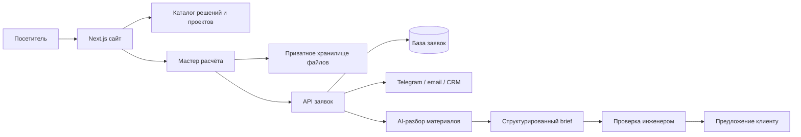

# Архитектура, миграция и развитие СтеклоСтройГрупп

## 1. Что уже реализовано

Сайт переведён на единую премиальную систему **Optical Monolith**: тёмная архитектурная фотография, точная инженерная сетка, тонкая типографика, медные акценты, эффект преломления стекла и аккуратная микроанимация.

Сейчас в новой структуре работают:

- главная страница;
- направления «Для дома» и «Для бизнеса»;
- каталог решений и шесть детальных страниц услуг;
- каталог проектов и три детальные страницы объектов;
- производство, компания, партнёры и контакты;
- четырёхшаговый мастер расчёта;
- политика конфиденциальности, страница благодарности и 404;
- мобильная навигация и адаптивные версии всех шаблонов;
- старые адреса сайта с переводом на новые страницы.

## 2. Целевая архитектура

### Клиентская часть

- Next.js App Router + TypeScript.
- Общие шаблоны для услуг, проектов и информационных страниц.
- Контент хранится отдельно от компонентов, поэтому карточки и тексты можно переносить в CMS без редизайна.
- Изображения оптимизируются, критические визуалы загружаются заранее, а тяжёлые эффекты имеют облегчённый мобильный режим.
- Все интерактивные элементы поддерживают клавиатуру, `prefers-reduced-motion` и понятные состояния фокуса.

### Серверная часть для продакшена

Текущая версия может собираться как статический экспорт для предпросмотра. Для полноценной обработки заявок нужен серверный режим Next.js на Vercel либо аналогичном Node-хостинге:

- `POST /api/leads` — создание заявки и серверная валидация;
- `POST /api/uploads/sign` — выдача короткоживущей ссылки на приватную загрузку;
- webhook/очередь — уведомление менеджера и безопасный запуск AI-разбора;
- Postgres — заявки, этапы обработки, UTM-метки и история согласий;
- приватное файловое хранилище — фото, PDF и чертежи без публичных URL.

Для клиентских материалов следует использовать закрытое хранилище: приватные объекты Vercel Blob по умолчанию требуют аутентифицированной доставки через серверную часть. [Документация Vercel Blob](https://vercel.com/docs/vercel-blob/private-storage)

### Контент и управление

На первом запуске контент остаётся в типизированных файлах репозитория: это быстрее, надёжнее и не создаёт новую панель ради редких правок. Когда появится ответственный редактор и регулярный поток новых объектов, данные можно перенести в headless CMS:

- услуги и их характеристики;
- проекты, галереи и параметры;
- сертификаты;
- статьи и SEO-страницы;
- вакансии и партнёрские материалы.

## 3. Карта страниц

| Раздел | Новый URL | Назначение |
|---|---|---|
| Главная | `/` | позиционирование, направления, решения, проекты, производство, расчёт |
| Для дома | `/dlya-doma/` | частные дома, квартиры, террасы, зимние сады |
| Для бизнеса | `/dlya-biznesa/` | фасады, витражи, входные группы, коммерческие объекты |
| Продукция | `/produktsiya/` | полный каталог конструкций и систем |
| Услуги | `/uslugi/` | замер, проектирование, производство, монтаж и сервис |
| ПВХ-окна | `/uslugi/okna-pvh/` | детальная услуга |
| Алюминиевые системы | `/uslugi/alyuminievye-sistemy/` | детальная услуга |
| Фасады и витражи | `/uslugi/fasady-i-vitrazhi/` | детальная услуга |
| Панорамное остекление | `/uslugi/panoramnoe-osteklenie/` | детальная услуга |
| Перегородки и входные группы | `/uslugi/peregorodki-i-vkhodnye-gruppy/` | детальная услуга |
| Зимние сады | `/uslugi/zimnie-sady/` | детальная услуга |
| Проекты | `/proekty/` | портфолио и доказательство компетенций |
| Производство | `/proizvodstvo/` | процесс, контроль качества, мощности |
| Компания | `/o-kompanii/` | опыт, команда, сертификаты |
| Партнёрам | `/partneram/` | дилеры, архитекторы, подрядчики |
| Новости | `/novosti/` | производство, системы, объекты и эксплуатация |
| Контакты | `/kontakty/` | телефоны, адреса, реквизиты, карта |
| Расчёт | `/raschet/` | основной конверсионный сценарий |

## 4. Миграция старого сайта

### Сопоставление старых адресов

| Старый URL | Новый URL | Тип |
|---|---|---|
| `/o-kompanii-proizvoditel-okon/` | `/o-kompanii/` | постоянный редирект |
| `/produktsiya-okna-pvh-alyuminievye-sistemy/` | `/produktsiya/` | постоянный редирект |
| `/uslugi-izgotovlenie-montazh-okon/` | `/uslugi/` | постоянный редирект |
| `/partneram-dileram-opt-pvh-aluminevye-systemy/` | `/partneram/` | постоянный редирект |
| `/kontakty-proizvoditel-okon/` | `/kontakty/` | постоянный редирект |
| `/raschet-stoimosti-okon-pvh-i-aluminevyh-konstrukcij/` | `/raschet/` | постоянный редирект |
| `/Новости/` | `/novosti/` | постоянный редирект |

Редиректы уже описаны в `vercel.json`, а в статическом режиме сохранены страницы-переходники. Vercel отдаёт постоянные редиректы как HTTP 308; на другом хостинге допустим HTTP 301. При переносе домена нужно выгрузить список всех проиндексированных URL из Search Console и аналитики, дополнить карту и проверить каждый адрес. Google рекомендует постоянные серверные редиректы, новые canonical-ссылки и обновлённую карту сайта при смене URL. [Официальное руководство Google](https://developers.google.com/search/docs/crawling-indexing/site-move-with-url-changes)

### Обязательные проверки перед переключением домена

1. Заморозить контент старого сайта и сделать полную выгрузку URL, метатегов, текстов, изображений, документов и форм.
2. Сопоставить каждый старый URL с максимально близкой новой страницей; не отправлять всё на главную.
3. Перенести title, description, полезные тексты, контакты, реквизиты и schema.org.
4. Проверить постоянные 301/308, canonical, `robots.txt`, `sitemap.xml`, Open Graph и 404.
5. Подключить Search Console, Яндекс Вебмастер, Метрику/GA4 и отслеживание заявок.
6. После переключения ежедневно проверять 404 и индексацию первую неделю, затем еженедельно первый месяц.
7. Сохранять редиректы минимум год, лучше постоянно для URL с внешними ссылками.

### Текущий блокер миграции

Ссылки на сертификаты старого сайта ведут в закрытую панель HostFly и без доступа возвращают экран авторизации. В новой версии они пока сохранены как внешние ссылки. Для полной миграции нужны исходные PDF либо доступ к старому хостингу; после получения документы надо перенести в контролируемое хранилище, проверить названия и даты и обновить ссылки.

## 5. AI-функции: что действительно полезно

### Первая версия: AI Brief Assistant

Пользователь прикладывает фото, чертёж или PDF и отвечает на несколько вопросов. Модель:

- распознаёт тип объекта и предполагаемый набор конструкций;
- извлекает указанные размеры и количество элементов;
- отмечает отсутствующие критические данные;
- задаёт только уточняющие вопросы;
- формирует структурированный brief для инженера;
- готовит понятное резюме для клиента.

Для интеграции используется серверный API; ключ модели никогда не попадает в браузер. Официальный SDK поддерживает серверные запросы и структурированную обработку входных данных. [OpenAI API quickstart](https://platform.openai.com/docs/quickstart/make-your-first-api-request)

AI не должен:

- автоматически назначать окончательную цену;
- подтверждать несущую способность или безопасность конструкции;
- обещать сроки без проверки загрузки производства;
- публиковать клиентские файлы или хранить их бессрочно;
- отправлять результат клиенту без проверки инженера на первом этапе.

### Дальнейшие функции

1. **Визуальный подбор решения** — варианты профиля, цвета и типа остекления на фотографии объекта с явной пометкой «концепт».
2. **Поиск похожих объектов** — показывает релевантные реализованные проекты по типу здания и системе.
3. **Помощник менеджера** — готовит черновик ответа, список вопросов и данные для CRM.
4. **Контроль полноты проекта** — проверяет, хватает ли документов для перехода к замеру или конструктору.
5. **База знаний** — отвечает по продуктам и процессу только на основании утверждённых материалов компании.

## 6. Этапы улучшения

### Этап 0. Инвентаризация и контент — 2–4 дня

- выгрузка старого сайта и аналитики;
- полный список URL, документов и форм;
- назначение владельцев контента;
- фиксация бизнес-метрик и CRM-маршрута.

### Этап 1. Премиальная система и UX — реализовано

- дизайн-система Optical Monolith;
- desktop/mobile;
- рабочие меню, табы, слайдеры, CTA и мастер расчёта;
- единая система внутренних страниц.

### Этап 2. Полная контентная миграция — 3–6 дней

- финальная сверка всех текстов и реквизитов;
- локализация сертификатов и документов;
- проверка изображений и разрешений на использование;
- расширение карты постоянных редиректов по данным Search Console.

### Этап 3. Заявки и CRM — 3–5 дней

- серверный API заявок;
- приватные загрузки;
- защита от спама и лимиты;
- уведомления Telegram/email;
- синхронизация с CRM или Google Sheets;
- статусы доставки и повторная отправка при сбое.

### Этап 4. AI Brief Assistant — 5–8 дней

- схема данных brief;
- извлечение из фото/PDF;
- уточняющий диалог;
- очередь и журнал обработки;
- обязательная инженерная проверка;
- политика хранения и удаления файлов.

### Этап 5. Запуск и SEO — 2–4 дня

- production-сборка;
- перенос домена и SSL;
- 301/308, canonical, sitemap и robots;
- performance и accessibility QA;
- аналитика событий и конверсий;
- smoke-тест на реальных устройствах.

### Этап 6. Рост — постоянно

- новые кейсы с параметрами и результатами;
- A/B-тест первого экрана и формы;
- SEO-страницы только под реальный спрос;
- разбор причин отказа на каждом шаге формы;
- улучшение AI-помощника на проверенных данных.

## 7. Метрики качества

- доля посетителей, начавших расчёт;
- завершение каждого шага формы;
- количество квалифицированных заявок;
- время от заявки до ответа менеджера;
- доля заявок с полным техническим brief;
- Core Web Vitals и отсутствие горизонтального скролла;
- 404 по старым URL и динамика индексации;
- процент AI-разборов, принятых инженером без существенной переработки.

## 8. Решение для запуска

Первая production-версия должна запускаться без автономного AI-ценообразования: новый премиальный интерфейс, полный контент, корректная миграция, защищённая форма и уведомление менеджера. AI Brief Assistant подключается следующим ограниченным этапом, когда определены ответственный инженер, срок хранения файлов и структура данных для CRM.
